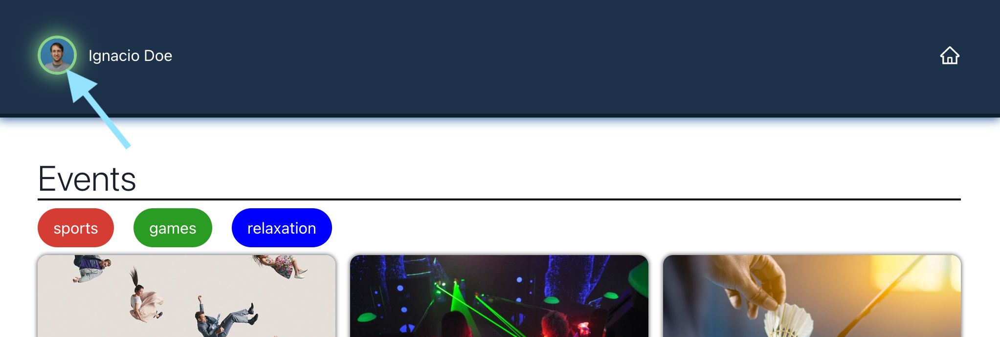
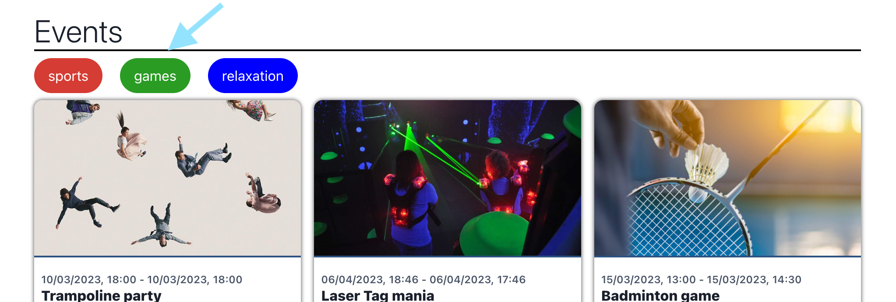
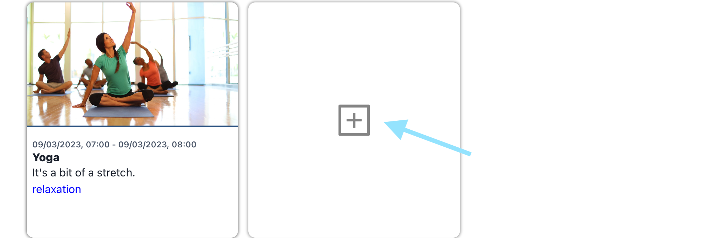
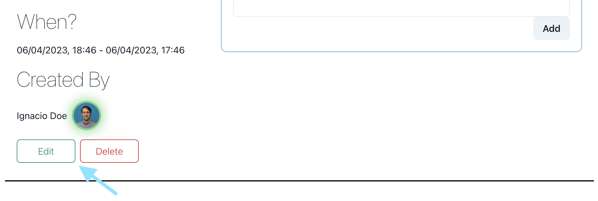
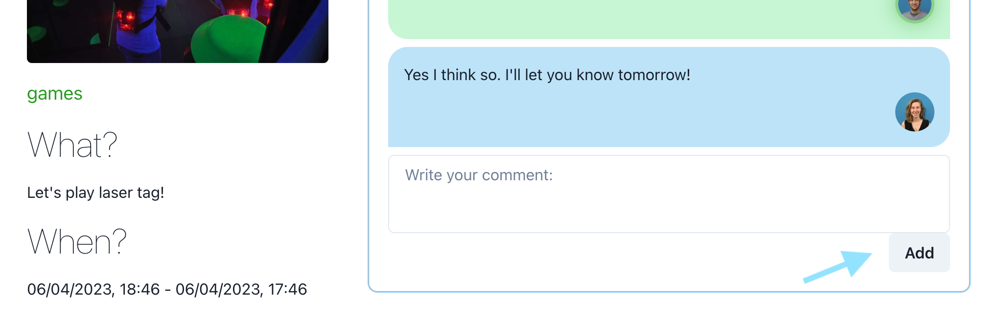

<h1 style="border-bottom: 1px solid black; font-weight: 300">WINC EVENTS</h1>

Winc events is a place to create edit and discuss events.

#### Switching User

In order to edit or delete events or comments you must be signed into the correct user.

To change user simple click on the profile in the top left corner and select the new user.

#### Filtering by categories

Click on the categories to toggle. Only events with at least 1 active category will be shown.

#### Creating an event

To create a new event click on the + card at the end of the list.

#### Editing or deleting an event

To edit or delete an event click the buttons at the bottom of the event page.

! _You must be signed into the correct user to delete or edit an event_

#### Leaving a comment

To write a comment simply type into the box and click "Add".

---

_The backend server is used to simulate real world data collection however any data added will not persist indefinitely_

Enjoy :)
